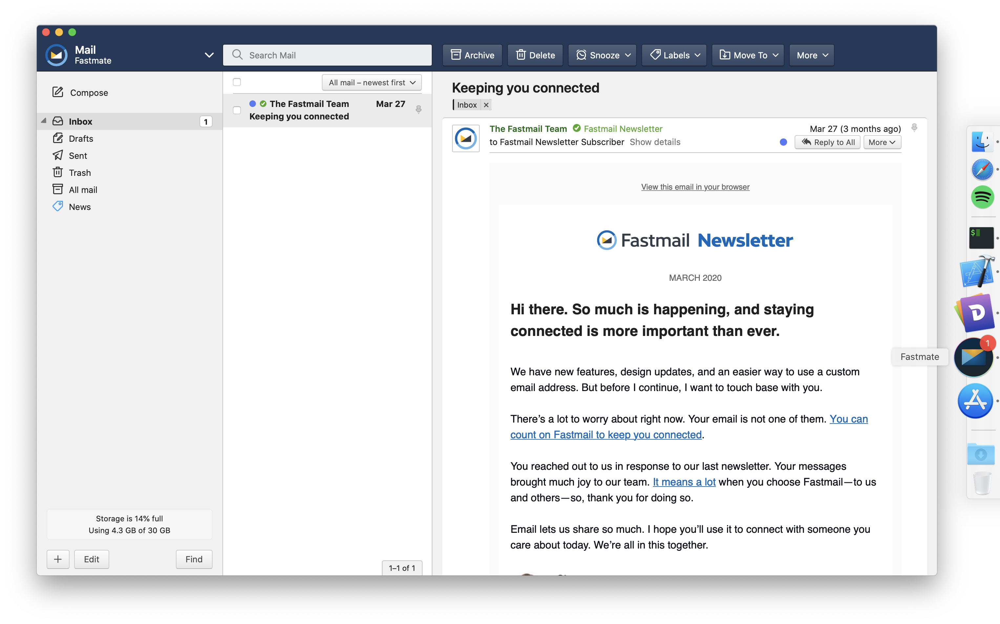

# Fastmate

A native [Fastmail](https://www.fastmail.com/)-wrapper for Mac.

## Features
- Desktop notifications for new mail
- Handles e-mail (mailto:) links
  - Can be set as your default e-mail software
- Dock badge for unread mail
- Status bar notifier (has to be enabled in settings)
- OSX shortcuts (<kbd>⌘N</kbd> for new draft, <kbd>⌘F</kbd> to search mail)
- User scripts
- Uses the system web stack

## Installation

Pre-built binaries can be found on the [release page](https://github.com/joelekstrom/fastmate/releases). To build it yourself you need to have Xcode and either disable code signing or change the bundle identifier to something else prior to compiling.

## Enabling push notifications
For Fastmate to receive push notifications for new e-mail, it has to be enabled within the _Fastmail_ settings from within Fastmate. It's disabled by default. Click the Fastmail logo in the top left of the window -> Settings -> Notifications -> check "Show a notification" for new messages.

## Setting as default e-mail software
If you want Fastmate to be the handler of `mailto://`-links, follow the guide at https://support.apple.com/en-us/HT201607 and choose Fastmate as "Default e-mail reader".

## Adding user scripts
Click Fastmate -> Preferences... -> User Scripts...

this will open a Finder-window with a folder where you can put `.js` files with your custom scripts.

## Troubleshooting

### Fastmate crashes on launch
This happens for some people on Mojave. It might be because of "app translocation". Moving the app into /Applications/ should solve the problem.

## Privacy
Your Fastmail login and e-mail are handled entirely by `WKWebView`, meaning that it is pretty much the same as running Fastmail in Safari. Fastmate does have access to the DOM and could potentially read your mail (it doesn't, but the privacy inclined might want to verify the source).

Here's what Fastmate does read:
- The title of the web page (what's shown in the tab when running Fastmail in your web browser) to show the unread mail counter.
- The unread count of each folder (depending on your settings)
- Web Notifications - Fastmate has a hook that simply forwards any web notifications to the OSX notification center. It does not read the contents of your notifications.
- The background color of the Fastmail toolbar, to be able to match your chosen Fastmail-theme.

Fastmate by default sends one network request outside of what Fastmail sends internally - it pings https://github.com/joelekstrom/fastmate/releases/latest
once a week to inform you if a new version is available. You can opt out of this in the settings.

## Disclaimer
Fastmate is not affilated with Fastmail in any way. This is a project I work on in my free time,
and both the binaries and source code are available for free and for anyone to use.
