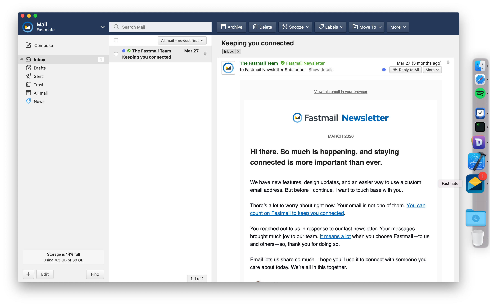

# Fastmate

A native [Fastmail](https://www.fastmail.com/)-wrapper for Mac.

## Features
- Desktop notifications for new mail
- Handles e-mail (mailto:) links
  - Can be set as your default e-mail software
- Dock badge for unread mail
- Status bar notifier (has to be enabled in settings)
- OSX shortcuts (<kbd>⌘N</kbd> for new draft, <kbd>⌘F</kbd> to search mail)
- Uses the system web stack

## Installation

Pre-built binaries can be found on the [release page](https://github.com/accatyyc/fastmate/releases). To build it yourself you need to have Xcode and either disable code signing or change the bundle identifier to something else prior to compiling.

## Privacy
Your Fastmail login and e-mail are handled entirely by `WKWebView`, meaning that it is pretty much the same as running Fastmail in Safari. Additionally, Fastmate does not make any network requests outside of those that Fastmail do internally. However, Fastmate does have access to the DOM and could potentially read your mail (it doesn't, but the privacy inclined might want to verify the source).

Here's what Fastmate does read:
- The title of the web page (what's shown in the tab when running Fastmail in your web browser) to show the unread mail counter.
- Web Notifications - Fastmate has a hook that simply forwards any web notifications to the OSX notification center. It does not read the contents of your notifications.
- The background color of the Fastmail toolbar, to be able to match your chosen Fastmail-theme.
